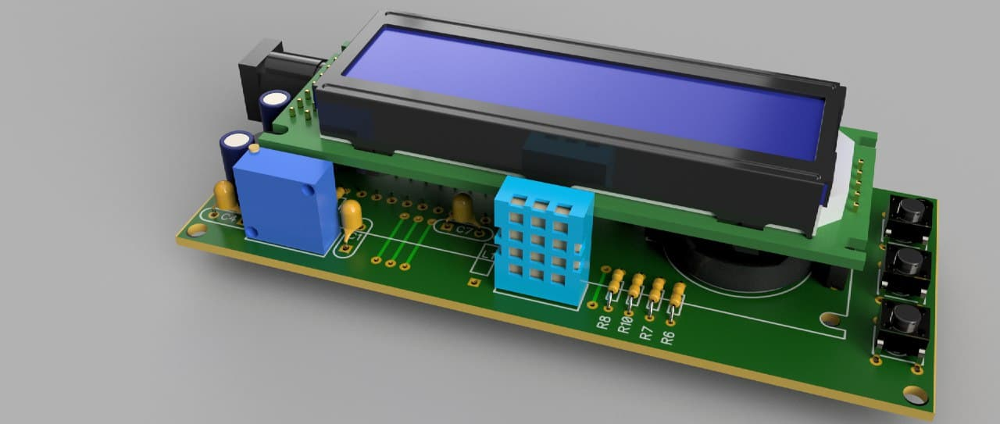
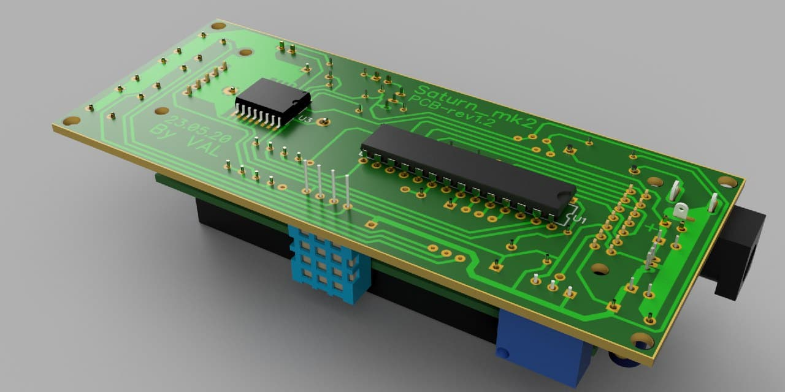
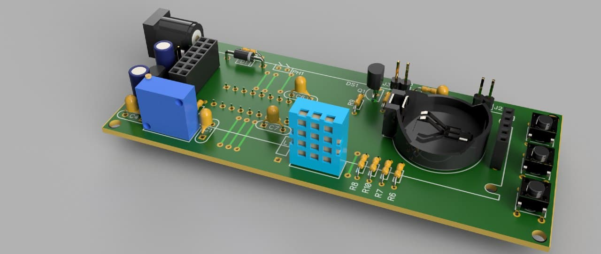
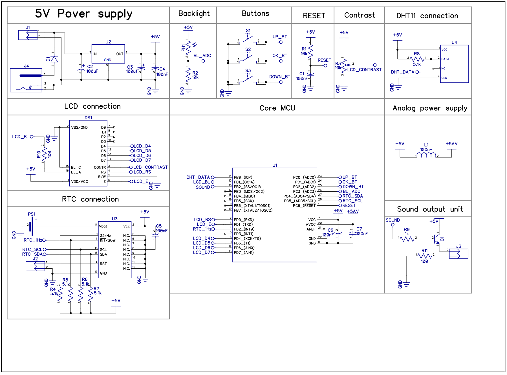

# Saturn
My watches projects

# Saturn_mk1
Simple clocks on ATmega8 MCU + 7 segments display and wathes crystal with 32 kHz resonant frequency crystal.

# Saturn_mk2
Simple clocks/alarm/room meteo station on Atmega8 + HD44780( 16x2 LCD) + DS3231 + DHT11/DHT22.
  - Three information screens - time, temperature/temperature and humidity, date and day.
  - Seven switching modes between information screens.
  - Two alarms.
  - Backlights brightness control.
  - Monophonic alarm melody.
  - Temperature measurement capability.
  - Humidity measurement capability.

 Device 3D view:
    
    
    

 Device schematic:
    

# Saturn_mk3
Simple clocks/alarm on STM32f103c8t6 + 3 8x8 LED matrices + DS3231 + metheo sensor.
  - 24 x 8 display.
  - 4 + 1 (user's custom) digit's fonts.
  - Two alarms with selectable melody for each alarm.
  - Temperature measurement capability.
  - Humidity measurement capability.
